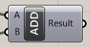
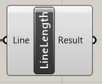
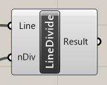

## ようこそ、ゆっくりしていってね

Grasshopper コンポーネントを開発して、それを紹介するサイトを GitHub Pages で作るサンプルページです。

## コンポーネント紹介

### ADD コンポーネント

入力された数値を足してその結果を返すコンポーネントです。

入力
- A
- B
  - 足し合わせたい二つの数字

出力
- Result
  - 足し算した結果

### LineLength コンポーネント

入力された Line の長さを返すコンポーネントです。

入力
- Line
  - 長さを測りたい Line

出力
- Result
  - 長さを計算した結果

### LineDivide コンポーネント

入力された Line を入力された数で分割して返すコンポーネントです。

入力
- Line
  - 分割したい Line
- nDiv
  - 分割数

出力
- Result
  - 分割した Line

## コンタクト

何かあればこちらに気軽に連絡ください！！！

[Twitter @hiron_rgkr](https://twitter.com/hiron_rgkr)

