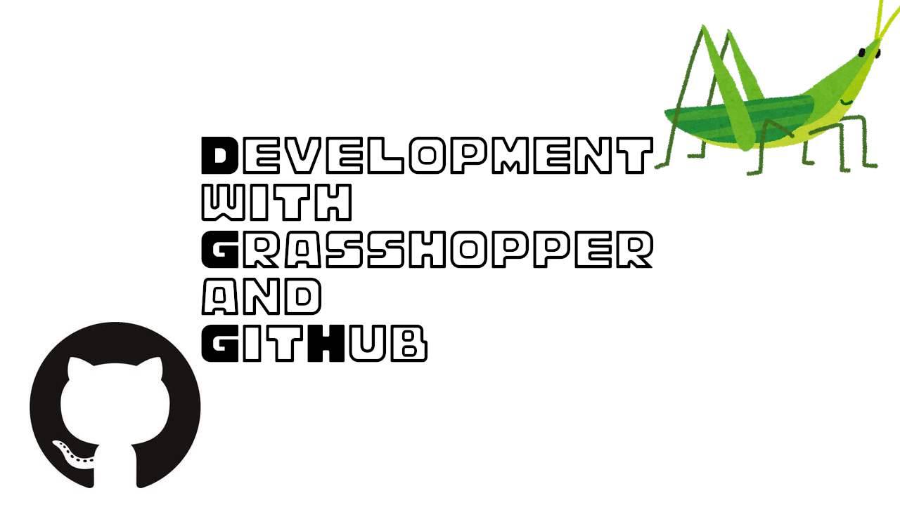

# Development with Grasshopper and GitHub

Using the development of Grasshopper components as an example, I'll show you how to develop using the various features of Github.

## Chapters

1. [Introduction](https://hrntsm.github.io/GrasshopperCISample/intro)
1. [Built with GitHub Actions](build-with-github-actions)
1. [Evaluate Code Quality](code-quality)
1. [Evaluate Code Maintainability](code-maintenace)
1. [Add Badge to README](add-badge)
1. [Create your own pages using GitHub pages](add-github-pages)
1. [Reference](reference)